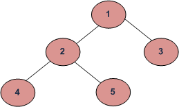
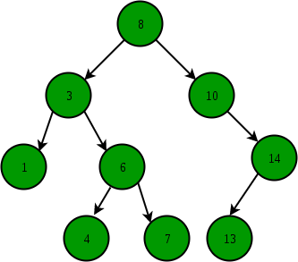

## Tree Traversal Types:

Depth First Traversals:

### (a) Inorder (Left, Root, Right) : 4 2 5 1 3

Uses of Inorder In the case of binary search trees (BST), Inorder traversal gives nodes in non-decreasing order. To get
nodes of BST in non-increasing order, a variation of Inorder traversal where Inorder traversal s reversed can be used.
Example: In order traversal for the above-given figure is 4 2 5 1 3.

### (b) Preorder (Root, Left, Right) : 1 2 4 5 3 Preorder traversal is used to create a copy of the tree. Preorder traversal

is also used to get prefix expression on an expression tree. Please see http://en.wikipedia.org/wiki/Polish_notation
know why prefix expressions are useful. Example: Preorder traversal for the above-given figure is 1 2 4 5 3.

### (c) Postorder (Left, Right, Root) : 4 5 2 3 1

Uses of Postorder Postorder traversal is used to delete the tree. Please see the question for the deletion of a tree for
details. Postorder traversal is also useful to get the postfix expression of an expression tree. Please
see http://en.wikipedia.org/wiki/Reverse_Polish_notation for the usage of postfix expression.

## BST

Binary Search Tree is a node-based binary tree data structure which has the following properties:

1. The left subtree of a node contains only nodes with keys lesser than the node’s key.
2. The right subtree of a node contains only nodes with keys greater than the node’s key.
3. The left and right subtree each must also be a binary search tree.